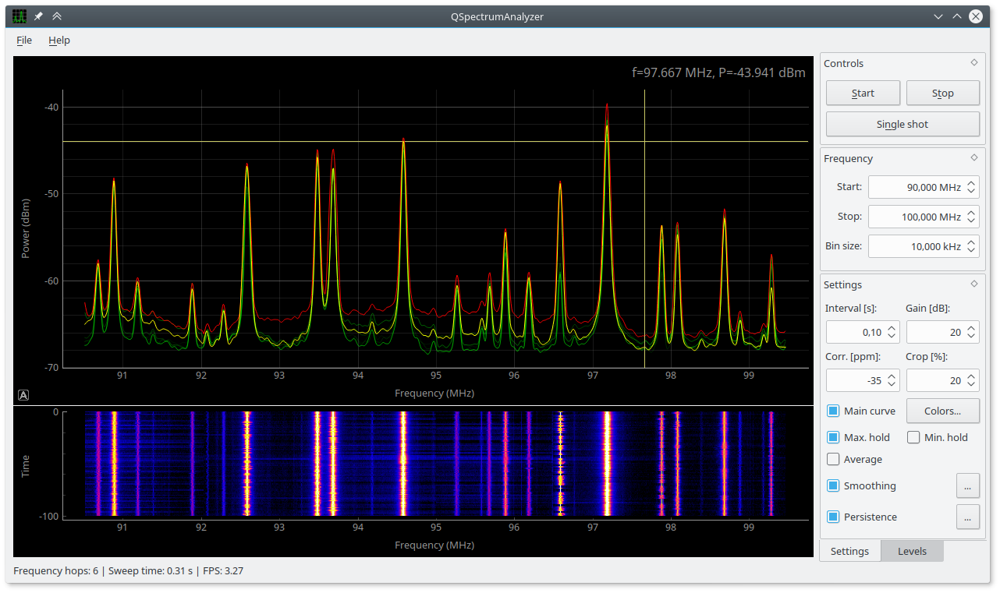
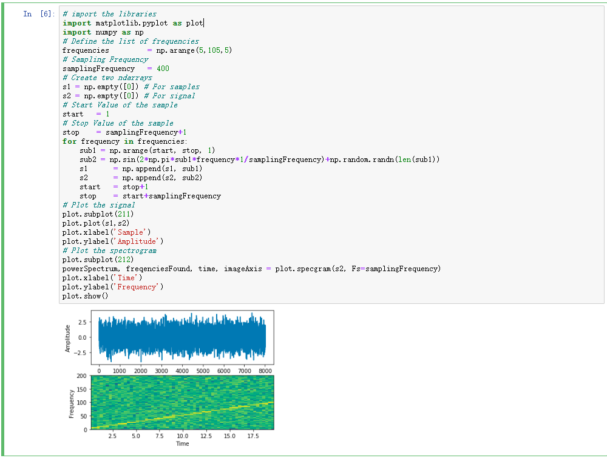
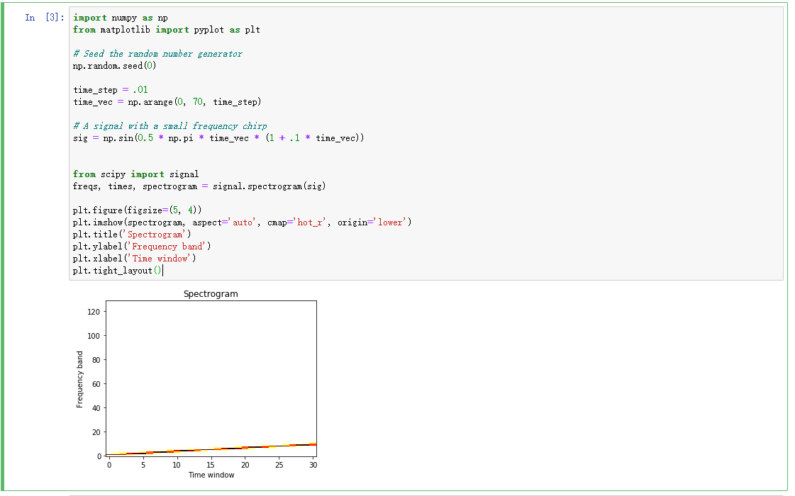

# MiniProject3
Demonstrating Python visualization tools (mainly spectrum, matplotlib and pylab) using Spectograms and Periodograms.

# PROJECT DESCRIPTION
The goal of this project is to demonstrate the visualization capabilities of python libraries in the field of Digital Signal Processing. Examples using spectograms and periodograms were chosen as they integrate various aspects of DSP as such providing ample opportunity to showcase the visualization tools available to us from the python libraries.

Fig 1: Spectrum Analyzer Using Spectrum Library (SciPy)

# SPECTOGRAMS
Spectograms are an incredibly useful tool for visualizing the time variation of frequency components of a signal. First some background information. In signal processing, fourier transforms are used to decompose a signal into its frequency components. For a more low level explanation: Every signal can be represented as a sum of complex exponentials of different frequencies. The fourier transform tells you how much (magnitude and phase) of each complex exponential is present in the given signal. However, this is only useful for stationary signals i.e. signals whose characteristics do not change with time - signals with a fixed impulse response function. Simple Fourier transforms are not sufficient when dealing with signals with varying impulse response. The fourier transform just gives the average value of each frequency component present in the signal for all time. This does not helps us know which frequencies are or are not present at any given time which is a key requirement for any speech/image processing. As such a new method for tackling this issue is required. The short time fourier transform.

### The Short time fourier transform (STFT) ###
A speech signal can be modelled as a Linear Time-Invariant Signal (LTI) system for short periods of time ~40 ms. This means that we can assume that the signal characteristics does not change within that window of time. Humans are physically incapable of changing the frequency components of the speech they produce faster than ~40ms.  As such we can perform a simple fourier transform and obtain the frequency components of the signal on each increment of 40ms of the signal. This is a very powerful concept as it gives the ability to visualize how the frequency components of a signal changes with time. This is the underlying concept used in speech detection, song detection, button dial frequency capture, image and audio enhancement etc. If one can visualize how the frequency contents of a signal changes with time, one can estimate which sound was made thus making ASR systems possible. The STFT is such a fundamental tool used in modern signal processing and python provides excellent libraries that are easily accesible and relatively easy to use to get the STFT of signal. In the picture below, I have demonstrated a simple chirp signal, showcasing its spectogram and frequency plot. A chirp signal is one in which its frequency components varies as a squared function of time. The libraries used here are Numpy: for mathematical calculations involving taking the fourier transforms on the windowed signal and MATPLOTLIB to plot the spectogram.

Fig 2: Spectogram of Chirp Signal using only numpy and matplot lib.

Another solution to visualize the chirp signal is to use the SIGNAL library from SCIPY. This is much easier to implement. 

Fig 3: Spectogram of Chirp Signal using signal.

As can be observed from Fig2 and Fig3, the spectogram allows us to capture the time variation of the frequency of the chirp. The frequency increases with time. 

### Generate Spectogram from .wav file using Python Libraries ###
